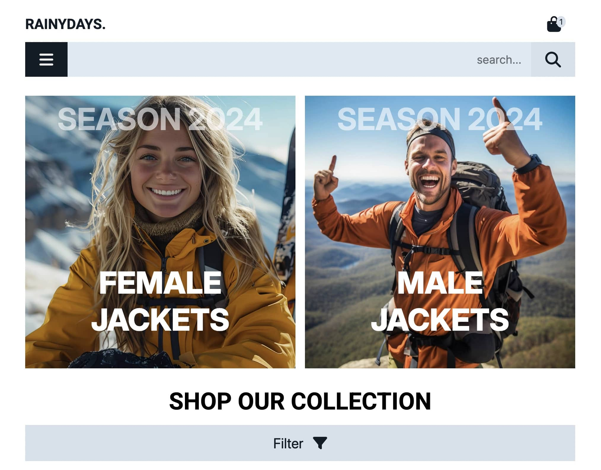

# JavaScript 1 Course Assignment - Rainydays



An interactive online store for outdoor clothing, built using JavaScript, HTML and CSS and connected to Noroffs RainyDays API.

## Description

**RainyDays** is an online store for outdoor clothing, where users can browse products, filter them by category, view detailed product pages, and add items to their shopping cart. The project was built to demonstrate JavaScript skills, including working with APIs, handling user interactions, and managing a shopping cart.

### **Features**

- Fetch and display products dynamically from the RainyDays API.
- Filter products by category, gender, or type.
- View detailed information on individual product pages.
- Add and remove items from the shopping cart.
- View a summary of selected items on the checkout page.
- Display an order confirmation after purchase.
- Handle errors and loading states gracefully.

## Built With

This project was built using:

- **HTML5**
- **CSS3**
- **JavaScript**
- **Fetch API** (for retrieving products from the RainyDays API)
- **LocalStorage** (for shopping cart functionality)

## Getting Started

### Installing

To get a local copy of the project up and running:

1. Clone the repository:

```bash
git clone https://github.com/martinekong/javascript-1-ca.git
```

2. Open the project in you code editor

## Contact

If you have any questions or feedback, feel free to reach out:

- LinkedIn: www.linkedin.com/in/martine-kongsrud
- Email: martinekongrus@outlook.com

## Acknowledgments

Special thanks to:

- Noroff for the project brief and API resources.
- Teachers for valuable feedback and discussions.
- Freepik for images.
